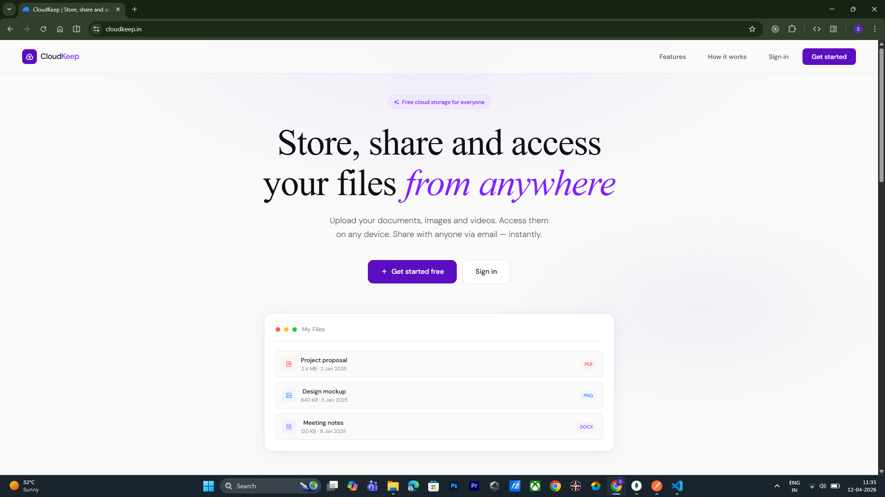
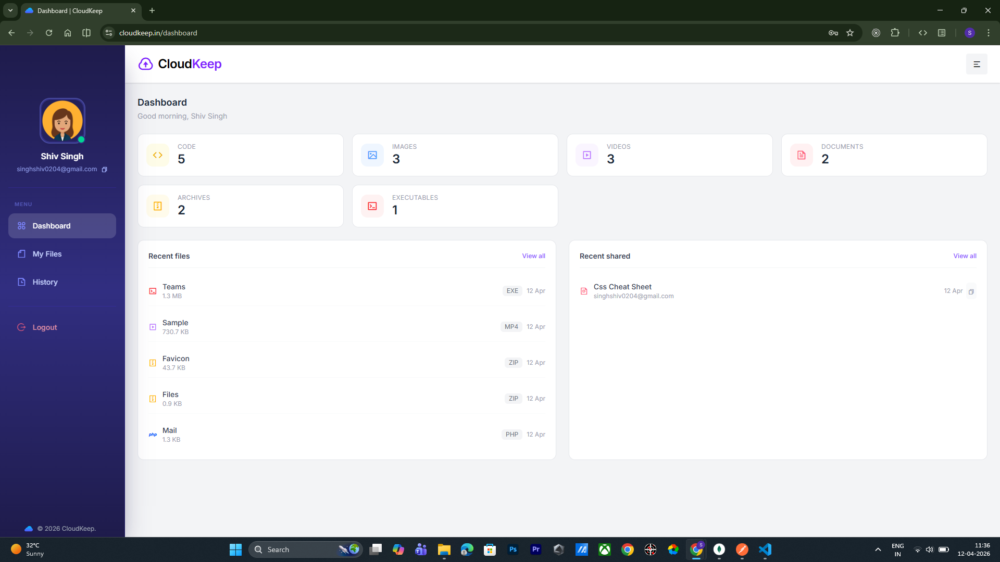
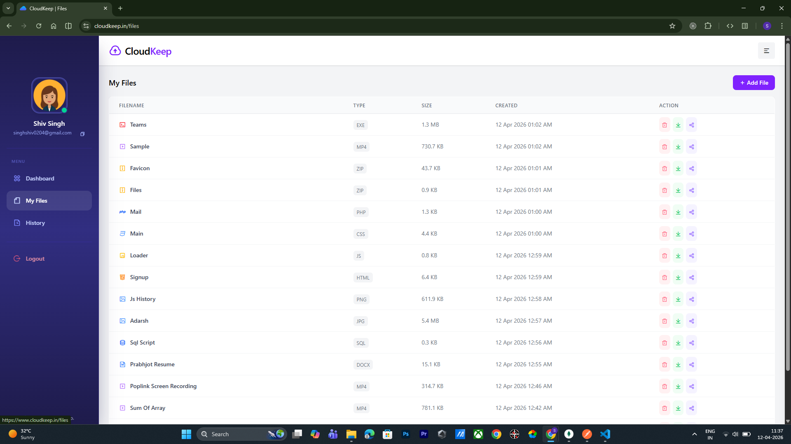
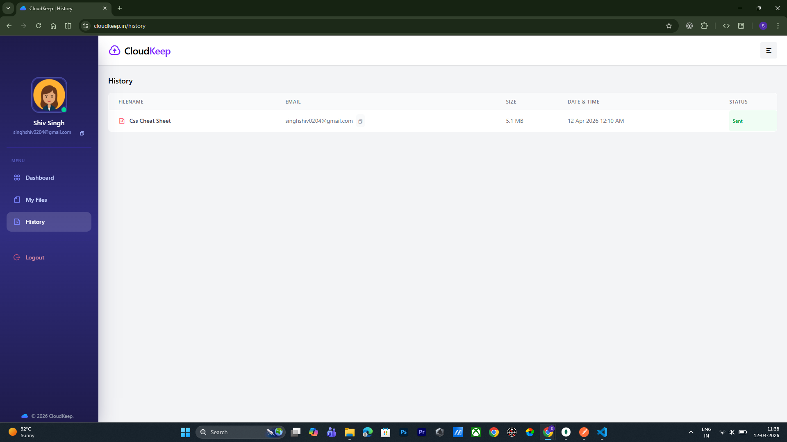
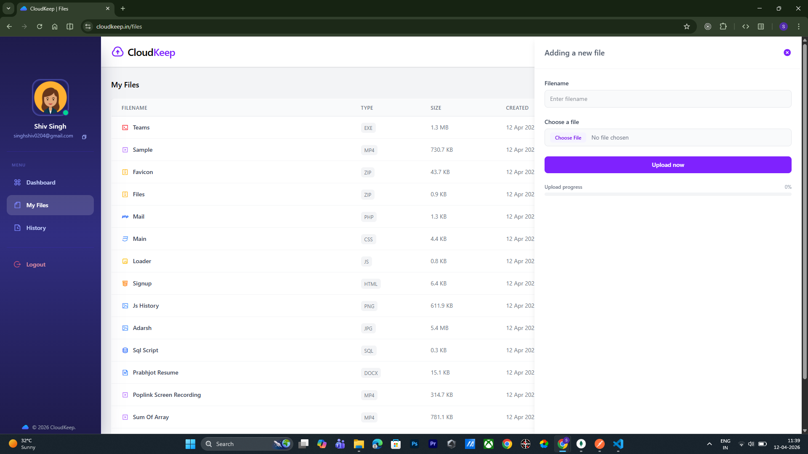
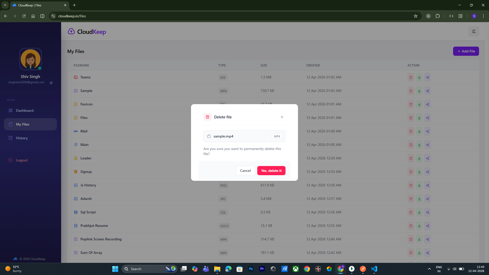

# CloudKeep — Store, share and access your files from anywhere


[🌐 Live Demo](https://www.cloudkeep.in) · [📂 Source Code](https://github.com/shivsinghcse/CloudKeep)


## Features
- Easy file upload
- Access anywhere
- Share via email
- Share history
- Instant download
- Storage dashboard

## Tech stack

### Frontend
- HTML
- CSS
- TailwindCSS
- JavaScript

### Backend
- Node.js
- Express.js
- MongoDB / Mongoose
- Cloudinary (file storage)
- Resend (email delivery)
- JWT (authentication)

## Architecture / How it works
The frontend is served as static HTML/CSS/JS from the Express server. When a user uploads a file, it is sent to the backend via a REST API, stored on Cloudinary, and the file metadata (name, size, type, URL) is saved in MongoDB. Authentication is handled via JWT tokens stored in localStorage and validated on every protected route via middleware. File sharing sends an email via Resend with a download link, and the share record is saved to MongoDB for history tracking. 


## Getting started

### Prerequisites
- Node.js v18+
- MongoDB (local or Atlas)
- Cloudinary account
- Resend account

### Installation
```bash
git clone https://github.com/shivsinghcse/CloudKeep.git
cd CloudKeep
npm install
```

### Run locally
```bash
npm run dev
```

App runs on `http://localhost:8080`

## Environment variables


Create a `.env` file in the root directory based on `.env.example`:

| Key | Description |
|---|---|
| `PORT` | Port the server runs on |
| `MONGO_URI` | MongoDB connection string |
| `JWT_SECRET` | Secret key for signing JWT tokens |
| `CLOUDINARY_CLOUD_NAME` | Your Cloudinary cloud name |
| `CLOUDINARY_API_KEY` | Cloudinary API key |
| `CLOUDINARY_API_SECRET` | Cloudinary API secret |
| `RESEND_API_KEY` | Resend API key for sending emails |
| `RESEND_FROM` | Sender email address via Resend |
| `SERVER` | Base URL of your server e.g. https://www.cloudkeep.in |

## API endpoints

### Auth
| Method | Endpoint | Description | Auth |
|---|---|---|---|
| POST | `/api/auth/signup` | Register new user | No |
| POST | `/api/auth/login` | Login and get JWT token | No |

### Files
| Method | Endpoint | Description | Auth |
|---|---|---|---|
| GET | `/api/file` | Get all files for current user | Yes |
| POST | `/api/file` | Upload a new file | Yes |
| DELETE | `/api/file/:id` | Delete a file | Yes |
| GET | `/api/file/download/:id` | Download a file | Yes |

### Share
| Method | Endpoint | Description | Auth |
|---|---|---|---|
| POST | `/api/share` | Share a file via email | Yes |
| GET | `/api/share` | Get share history | Yes |

### Dashboard
| Method | Endpoint | Description | Auth |
|---|---|---|---|
| GET | `/api/dashboard` | Get file stats by category | Yes |


## Folder structure

```
CloudKeep/
├── config/
│   └── db.js
├── controller/
│   ├── authController.js
│   ├── fileController.js
│   ├── shareController.js
│   └── dashboardController.js
├── middleware/
│   └── authMiddleware.js
├── model/
│   ├── User.js
│   ├── File.js
│   └── Share.js
├── view/
│   ├── app/
│   │   ├── index.html
│   │   ├── login.html
│   │   ├── signup.html
│   │   ├── dashboard.html
│   │   ├── files.html
│   │   └── history.html
│   ├── images/
│   └── js/
│       ├── common.js
│       ├── layout.js
│       ├── session.js
│       ├── dashboard.js
│       ├── myFiles.js
│       └── history.js
├── .env
├── .env.example
├── .gitignore
├── index.js
└── package.json
```


## Screenshots








## Author
- **Shiv Singh**
- [GitHub](https://github.com/shivsinghcse)
- [LinkedIn](https://www.linkedin.com/in/shivsingh98/)
- singhshiv0204@gmail.com